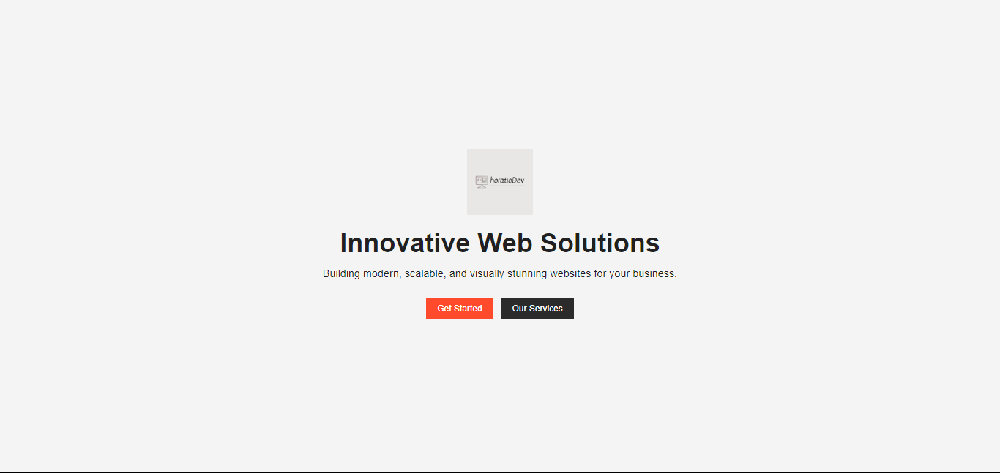

# HoratioDev - Web Agency

HoratioDev is a professional web agency specializing in building modern, scalable, and visually appealing websites for businesses. This project is a hero section for the company's landing page.

## Live Demo

[Click here to view the live demo](https://scrimba-horatio-web-agency-hero.netlify.app/)

## Screenshot



## Features

- **Hero Section**: A full-screen hero section with a background image, logo, headline, and call-to-action buttons.
- **Responsive Design**: The layout is fully responsive, ensuring a great user experience on all devices.
- **Call to Action**: Two buttons for users to "Get Started" or explore "Our Services."

## Technologies Used

- **HTML5**: For structuring the webpage.
- **CSS3**: For styling the hero section, including responsive design, layout, and typography.

## Setup Instructions

1. Clone this repository to your local machine:
   ```bash
   git clone https://github.com/your-username/scrimba-web-agency-hero.git
